# react-truffle-metacoin-boilerplate
Simple boilerplate with React, Truffle, Ganache, Webpack, and Babel

## screenshots
<table>
	<tr>
  	<td> 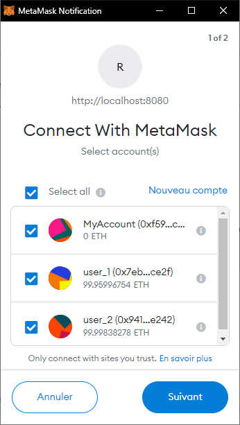 </td>
  	<td> 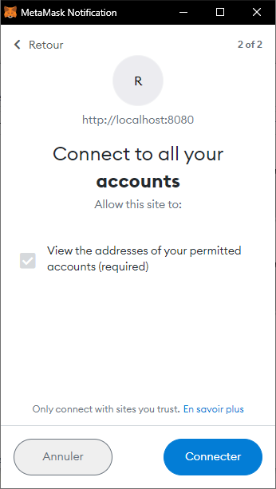 </td>
  	<td> 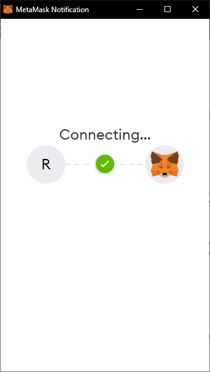 </td>
	</tr>
	<tr>
  	<td> 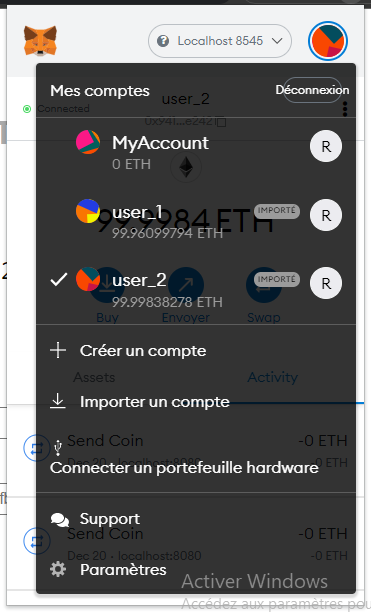 </td>
  	<td> 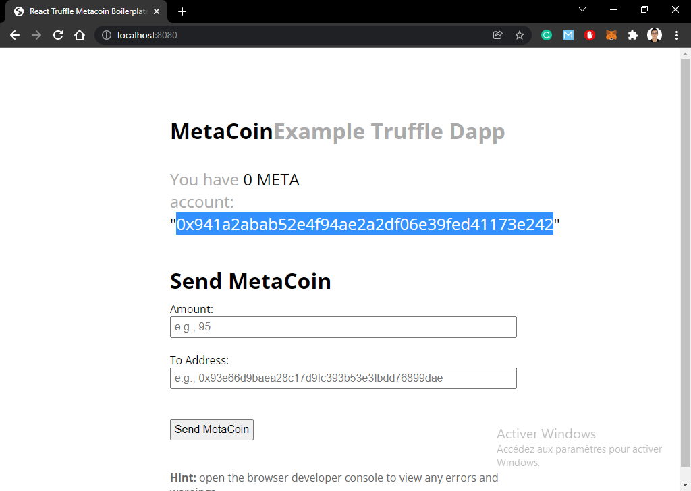 </td>
  	<td> 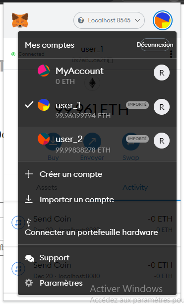 </td>
	</tr>
	<tr>
  	<td> 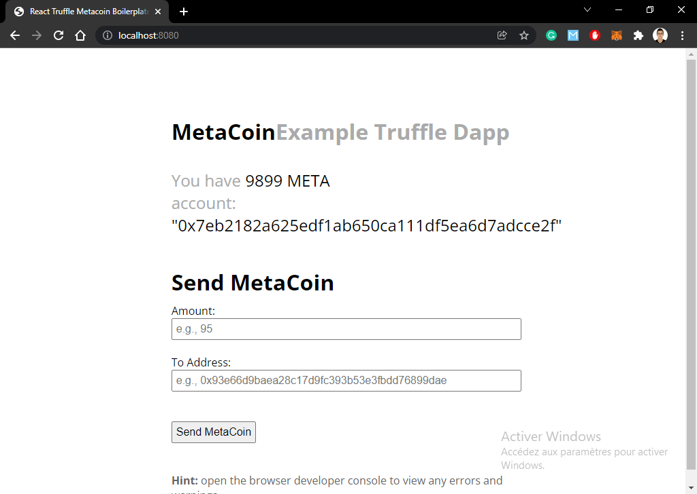 </td>
  	<td> 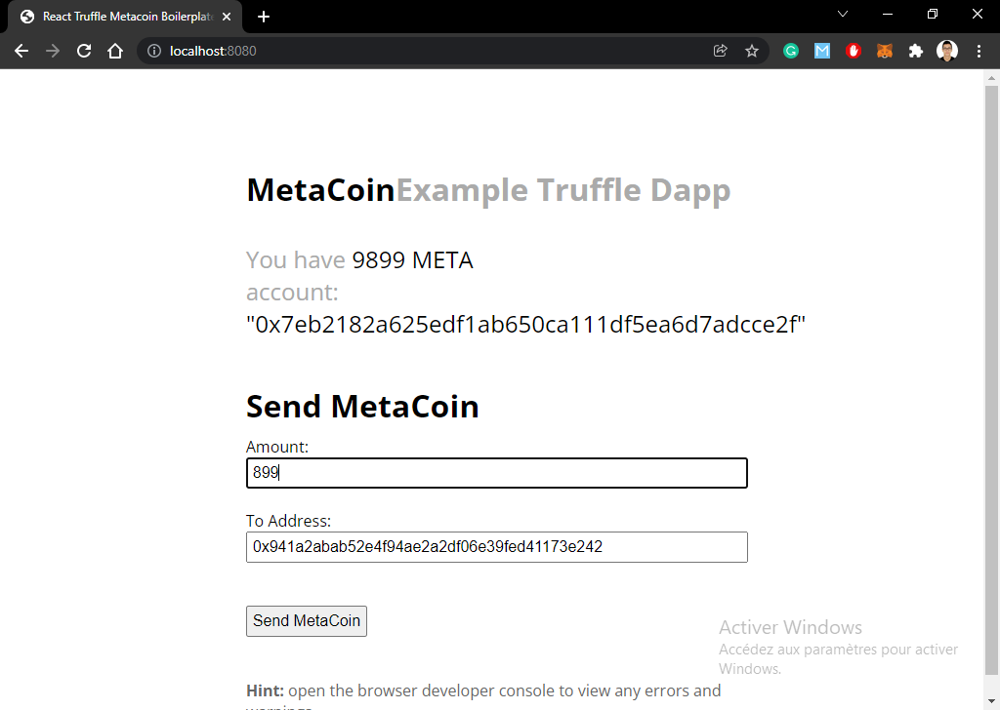 </td>
  	<td> 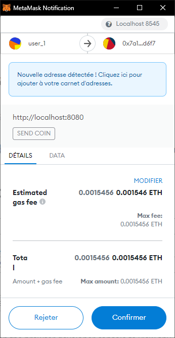 </td>
	</tr>
	<tr>
  	<td> 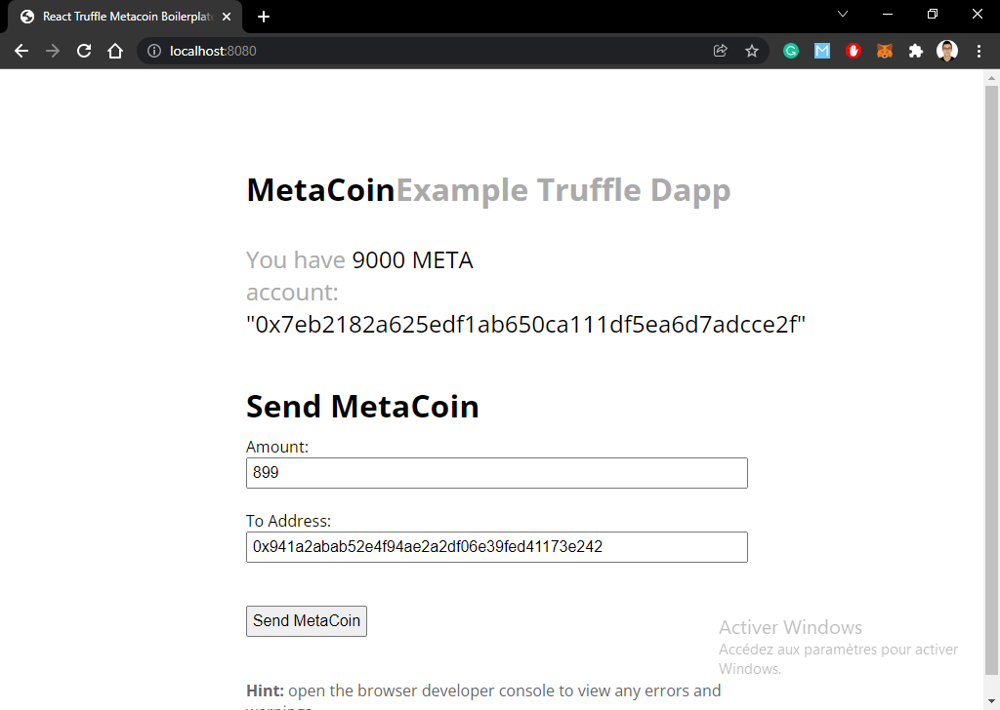 </td>
  	<td> 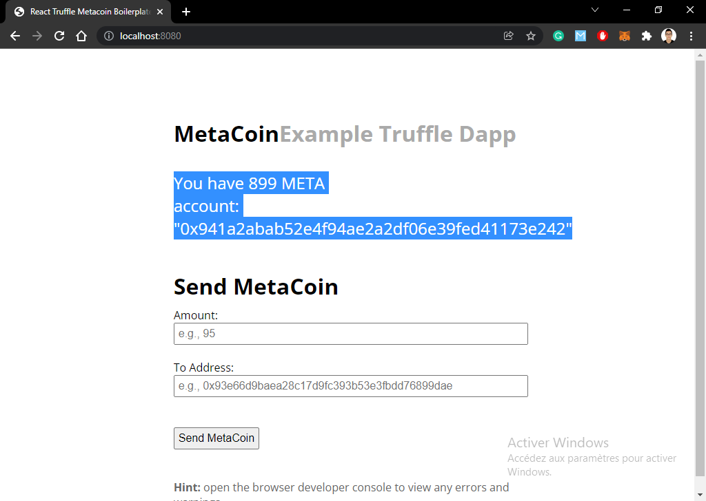 </td>
	</tr>
</table>

```
git clone git@github.com:Rami-Majdoub/MetaCoin-React.git
```
```
cd MetaCoin-React/
```
```
npm install
```
```
truffle compile
```
```
(new terminal window)
ganache-cli
```
```
truffle migrate --reset
```
```
(install MetaMask -- add top two private keys from ganache-cli log (e.g. David and Sally)
```
```
npm start
```
```

Go to `localhost:8080`
